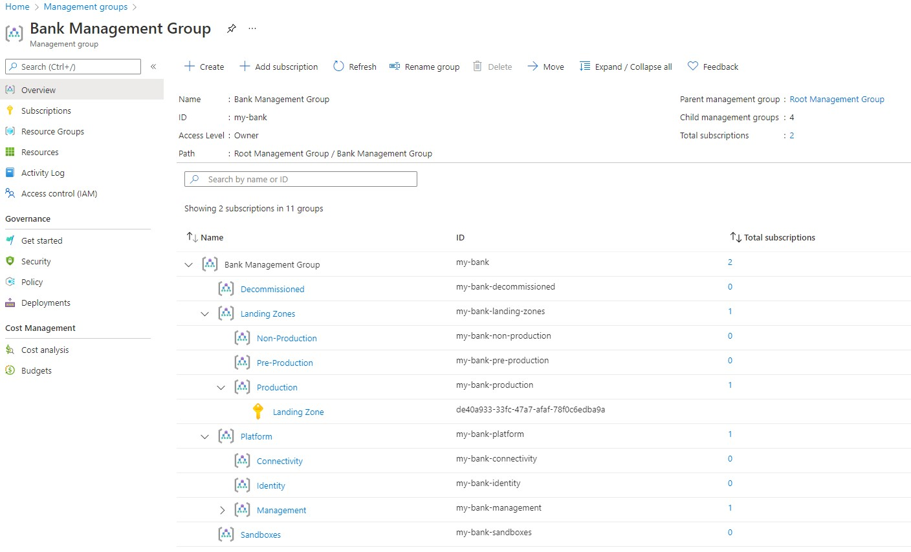
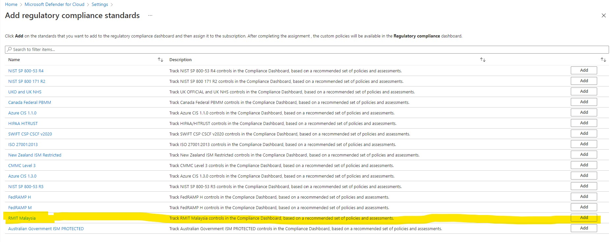
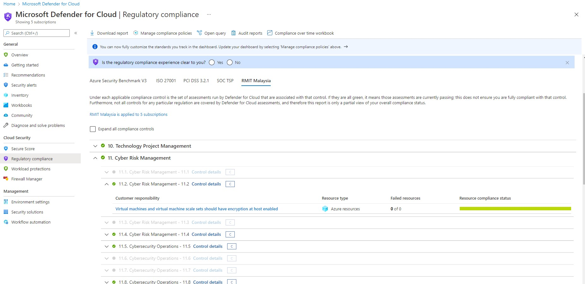
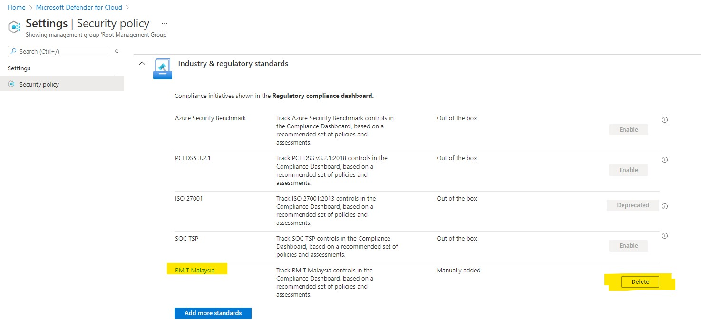

# Malaysia’s Risk Management in Technology (RMiT) Regulatory Compliance as code and Azure Landing Zone in Terraform.
# Background

The Bank Negara of Malaysia is the Central Bank of Malaysia. It provides monetary policy for the country and regulates the financial sector within Malaysia. The Risk Management in Technology (RMiT) policy was created to ensure Malaysian financial institutions properly manage their cyber-risk exposure by establishing the necessary risk frameworks, governance structures, policies, and procedures.

The purpose of the reference implementation is to guide [Bank Negara of Malaysia’s Risk Management in Technology (RMiT) Regulatory Compliance](https://www.bnm.gov.my/documents/20124/963937/Risk+Management+in+Technology+%28RMiT%29.pdf/810b088e-6f4f-aa35-b603-1208ace33619?t=1592866162078). This guide helps to ensure that the Microsoft Malaysian financial institutions customers on building Landing Zones in their Azure environment. The reference implementation is based on [Cloud Adoption Framework for Azure](https://docs.microsoft.com/azure/cloud-adoption-framework/ready/landing-zone/) and provides an opinionated implementation that enables to ensure that technology risk management framework (TRMF) 9.2 (e), (f), (g) and cyber resilience framework (CRF) 11.3 (d), (e), (g) remain relevant on an ongoing basis and meet the regulatory compliance by using [NIST SP 800-53 Rev. 4](https://docs.microsoft.com/azure/governance/policy/samples/nist-sp-800-53-r4) and [Risk Management in Technology (RMiT) policies.](https://docs.microsoft.com/en-us/azure/governance/policy/samples/rmit-malaysia)

# Business Challenges

The financial institutions need to establish end to end process of identification, assessment, mitigation, and monitoring. Across RMiT  domains. 

- Financial institutions need to ensure the TRM framework to be an essential part security infrastructure. 
- Define roles & responsibilities, risk assessment, risk classification, controls, risk mitigations, and monitoring.
- Enforce compliance with corresponding regulatory policies
- The published RMiT policy required financial institutions to cover the following six domains:
- Four technical domains of namely
- Technology Risk Management
- - Technology Operations Management
- - Cybersecurity Management
- - Technology Audit
- Two non-technical domains
- - Governance
- - Internal Awareness & Training

# What is RMiT Compliance as code (CaC)

The RMiT Compliance as code focuses on four technical domains and provide Azure Policies. 

- Azure Policy helps to establish clear governance policies for a technology project, along with continuous monitoring and compliance over time report.
- CaC helps organizations conceptualize the design and maintenance of security infrastructure in compliance with their business goal
- Ensure cryptographic controls, key generation policies and certificate are monitored and audited/enforce at platform level.
- Helps to audit information access control which includes identification, authentication, authorization, access denial, password policy, multifactor authentication, and monitoring the user activity by integrating Activity and Azure AD logs.
- Audit the patch for vulnerabilities for Cloud resources
- Landing zone helps establish network design, which includes network service management, network monitoring, virtual network design, log maintenance, network segmentation, and network security.

# Benefits
- RMiT related cybersecurity practices also act as a baseline for cyber insurance and legal and regulatory compliances.
- Financial institutes will accelerate the opportunity and stay ahead of their competitors. 
- Incorporating RMiT will encourage financial institutions to acquire third party assistance, hence, transferring the risk burden from the institution to vendor. 

## Compliance as code (CaC) Goals 
- Establishing the necessary risk frameworks, governance structures, policies, procedures to meet RMiT regulatory requirements 
- Accelerate the use of Azure in financial services through onboarding multiple types of workloads including, Azure IaaS, Lift & Shift, App Dev and Data & AI.
- Enforcing sets of RMiT controls and ensuring these are followed at scale is critical to a thriving digital business. 
- Simplify compliance management through a single source of compliance, audit reporting and auto remediation.
- By adopting an engineering mindset, through code you can make compliance automatic, releasing your company to focus on higher value activities.
- Deployment of DevOps frameworks & business processes to improve agility.
## Compliance as code (CaC) Non-Goals

- Automatic approval / notification for Risk Management in Technology. Customers must collect evidence, customize to meet their regulatory requirements and submit for Authority to Operate based on their risk profile, requirements and process. Refer [Appendix 7 Risk Assessment Report](https://www.bnm.gov.my/documents/20124/963937/Risk+Management+in+Technology+%28RMiT%29.pdf/810b088e-6f4f-aa35-b603-1208ace33619?t=1592866162078)
- Compliant on all Azure Policies when the reference implementation is deployed. This is due to the shared responsibility of cloud and customers can choose the Azure Policies to exclude. For example, using Azure Firewall is an Azure Policy that will be non-compliant since majority of the financial institutions customers use Network Virtual Appliances such as Palo Alto, Check Point, Fortinet. Customers must review [Microsoft Defender for Cloud Regulatory Compliance dashboard](https://docs.microsoft.com/en-gb/azure/defender-for-cloud/update-regulatory-compliance-packages) and apply appropriate exemptions.
- Automation does not configure firewalls deployed as Network Virtual Appliance (NVA). In this reference implementation, Fortinet firewalls can be deployed but customer is expected to configure and manage upon deployment.
# Onboarding to RMiT Compliance as code using Azure Landing Zone 

The [Terraform Module for Cloud Adoption Framework Enterprise-scale](https://registry.terraform.io/modules/Azure/caf-enterprise-scale/azurerm/latest) provides an opinionated approach for deploying and managing the core platform capabilities of [Cloud Adoption Framework enterprise-scale landing zone architecture](https://docs.microsoft.com/en-gb/azure/cloud-adoption-framework/ready/landing-zone/) using Terraform.

The following examples are designed to help build an understanding of how to use the module, ranging from basic deployments covering the core resource hierarchy from Enterprise-scale, through to more advanced scenarios.

Step by step guide refer [Terraform Module for Cloud Adoption Framework Enterprise-scale repo.](https://github.com/Azure/terraform-azurerm-caf-enterprise-scale/wiki/Examples) 

In this post we will focus on onbording RMiT Compliance as code using Azure Landing Zone terraform. 

# How to Deploy Azure Landing Zones via Terraform 
To add it as a custom initiative:
New-AzPolicySetDefinition -Name "RMIT Test" -GroupDefinition .\groups.json -PolicyDefinition .\policies.json -Parameter .\params.json
You can then further assign it in your Azure Portal in whichever scope.

Note: we’ll need to modify the parameters for some key policies like “allowed location” and “allowed resource type” as they are left empty and will not be able to deploy anything on Azure without it.
## Deployment Guide

Detailed information about how to use, configure and extend this module can be found on our Wiki:

[Pre-requisites](terraform/pre-rquisites.md)
[Home](https://github.com/Azure/terraform-azurerm-caf-enterprise-scale/wiki/Home)
[User Guide](https://github.com/Azure/terraform-azurerm-caf-enterprise-scale/wiki/User-Guide)
[Examples](https://github.com/Azure/terraform-azurerm-caf-enterprise-scale/wiki/Frequently-Asked-Questions)
[Frequently Asked Questions](https://github.com/Azure/terraform-azurerm-caf-enterprise-scale/wiki/Frequently-Asked-Questions)
[Troubleshooting](https://github.com/Azure/terraform-azurerm-caf-enterprise-scale/wiki/Troubleshooting)
[Contributing](https://github.com/Azure/terraform-azurerm-caf-enterprise-scale/wiki/Contributing)

## 1. Deployment Steps
### Clone the repo and go to terraform directory where the configuration codes reside.
```
git clone git@github.com:Azure/regulatory-compliance-initiatives.git
cd regulatory-compliance-initiatives/terraform/
```
## 2. Login to your identity
You may follow the guide in this documentation for further reference
https://registry.terraform.io/providers/hashicorp/azurerm/latest/docs/guides/azure_cli

Run the following command and login via browser
```terraform
az login
```
Check for subscription list given to your user account
```terraform
az account show
```
You should see the output with the following format.
```terraform
[
  {
    "cloudName": "AzureCloud",
    "id": "00000000-0000-0000-0000-000000000000",
    "isDefault": true,
    "name": "PAYG Subscription",
    "state": "Enabled",
    "tenantId": "00000000-0000-0000-0000-000000000000",
    "user": {
      "name": "user@example.com",
      "type": "user"
    }
  }
]
```
[Skip if you are already in the correct subscription]
Here you should make sure you are signed into the correct subscription, otherwise you may use the following command to set to the correct subscription
```terraform
az account list
az account set --subscription="SUB_ID_HERE"
```
## 3. Run Terraform
Once you have logged in, make sure you are in the right directory shown in step 1, and run the following commands.

```terraform
terraform init
terraform plan
```
You may take this opportunity to verify the planned changes after running terraform plan as it does not apply to your environment yet. Otherwise proceed for deployment by running 
```terraform
terraform apply -auto-approve -parallelism=50
```
This process may take up to 30 minutes. Once the run is complete, you may review the changes in the portal under "Management Groups" and "Azure Policy"

# 4. How to modify management group

Management Groups enable organizations to efficiently manage access, governance and compliance across all subscriptions. Azure management groups provide a level of scope above subscriptions. Subscriptions are organized into containers called "management groups" and apply Azure Policies and role-based access control to the management groups. All subscriptions within a management group automatically inherit the settings applied to the management group.

Management groups give you enterprise-grade management at a large scale no matter what type of subscriptions you might have. All subscriptions within a single management group must trust the same Azure Active Directory tenant.

Azure Landing Zones for Financial Services Industry in Malaysia recommends the following Management Group structure. This structure can be customized based on your organization's requirements. Specifically:

- Landing Zones will be split by 3 groups of environments (DEV/TEST, QA, PROD).
- Sandbox management group is used for any new subscriptions that will be created. This will remove the subscription sprawl from the Root - Tenant Group and will pull all subscriptions into the security compliance.

## To change Management Group name 
modify variables.tf following parameter value
```terraform
variable "root_name" {
  type    = string
  default = "Bank Management Group"
}

variable "root_id" {
  type    = string
  default = "fsieszl"
}

```
To change root group name visit [Changing Root Parent ID](https://github.com/Azure/terraform-azurerm-caf-enterprise-scale/issues/190)  
# 5. Deploy Landing Zone Archetypes 

To deploy Enterprise-scale with a starter configuration based mainly on module defaults, including the additional Management Groups used for demonstrating the Enterprise-scale Landing Zone archetypes:

- Corp
- Online
- SAP

Visit [Examples] [Deploy Demo Landing Zone Archetypes](https://github.com/Azure/terraform-azurerm-caf-enterprise-scale/wiki/%5BExamples%5D-Deploy-Demo-Landing-Zone-Archetypes)

modify main.tf following parameter value set the vaule "true"
```terraform
  # Configuration settings for optional landing zones
  deploy_corp_landing_zones   = true
  deploy_online_landing_zones = true
  deploy_sap_landing_zones    = true
  deploy_demo_landing_zones   = false

```
## Deploy Custom Landing Zone 

As we stated above this structure can be customized based on your organization's requirements. Specifically:

for example the below Landing Zones will be split by 3 groups of environments 
- Production
- Pre-Production
- Non-Production

You can change this vaule to anything DEV, TEST, PROD or something like [What about our management group hierarchy?](https://docs.microsoft.com/en-us/azure/cloud-adoption-framework/ready/enterprise-scale/faq) the detail guide how to modify the main object parameters [refe to our custom landing zone](https://github.com/Azure/terraform-azurerm-caf-enterprise-scale/wiki/%5BVariables%5D-custom_landing_zones)

```terraform
#custom landing zone deployment
custom_landing_zones = {
    "${var.root_id}-production" = {
      display_name               = "Production"
      parent_management_group_id = "${var.root_id}-landing-zones"
      subscription_ids           = []
      archetype_config = {
        archetype_id   = "default_empty"
        parameters     = {}
        access_control = {}
      }
    }
    "${var.root_id}-pre-production" = {
      display_name               = "Pre-Production"
      parent_management_group_id = "${var.root_id}-landing-zones"
      subscription_ids           = []
      archetype_config = {
        archetype_id   = "default_empty"
        parameters     = {}
        access_control = {}
      }
    }
    "${var.root_id}-non-production" = {
      display_name               = "Non-Production"
      parent_management_group_id = "${var.root_id}-landing-zones"
      subscription_ids           = []
      archetype_config = {
        archetype_id   = "default_empty"
        parameters     = {}
        access_control = {}
      }
    }
  }
```
  
# 6. Hub-spoke network topology in Azure
The hub virtual network acts as a central point of connectivity to many spoke virtual networks. The hub can also be used as the connectivity point to your on-premises networks. The spoke virtual networks peer with the hub and can be used to isolate workloads.

Hub and spoke is a networking model for efficiently managing common communication or security requirements. It also helps avoid Azure subscription limitations. This model addresses the following concerns:

- Saving on costs and efficient management: Centralize services that can be shared by multiple workloads, like network virtual appliances (NVAs) and DNS servers. With a single location for services, IT can minimize redundant resources and management effort.

- Overcoming subscription limits: Large cloud-based workloads might require using more resources than a single Azure subscription contains. Peering workload virtual networks from different subscriptions to a central hub can overcome these limits. For more information, see [Azure subscription and service limits.](https://docs.microsoft.com/en-us/azure/azure-resource-manager/management/azure-subscription-service-limits)

- A separation of concerns: You can deploy individual workloads between central IT teams and workload teams.

To [Deploy Connectivity Resources With Custom Settings](https://github.com/Azure/terraform-azurerm-caf-enterprise-scale/wiki/%5BExamples%5D-Deploy-Connectivity-Resources-With-Custom-Settings)

# 7. Single Subscription deployment
You can deploy the Hub and spoke in Single Subscription for testng or development. A single hub-and-spoke implementation can scale up to a large number of spokes, but as with every IT system, there are platform limits. The hub deployment is bound to a specific Azure subscription, which has restrictions and limits. One example is a maximum number of virtual network peerings. For more information, see [Azure subscription and service limits.](https://docs.microsoft.com/en-us/azure/azure-resource-manager/management/azure-subscription-service-limits)

Step by step guide to [Single Subscription deployment](https://github.com/Azure/terraform-azurerm-caf-enterprise-scale/wiki/%5BUser-Guide%5D-Provider-Configuration#single-subscription-deployment)

Edit following file and un comment following code block to deploy 
### ``` main.tf ``` 
```
# This will be used for the deployment of all "Connectivity resources" to default`.
   deploy_connectivity_resources    = var.deploy_connectivity_resources
   subscription_id_connectivity     = data.azurerm_client_config.core.subscription_id
   configure_connectivity_resources = local.configure_connectivity_resources
```
### ``` settings.connectivity.tf ```

``` terraform
# Deploy Connectivity Resources With Custom Settings The settings.connectivity.tf file contains a local variable containing the custom configuration for the configure_connectivity_resources input variable. This helps to keep the module block clean, whilst providing clear separation between settings for different groups of resources.

# Configure the connectivity resources settings

configure_connectivity_resources = {
    settings = {
      hub_networks = [
        {
          enabled = true
          config = {
            address_space                = ["10.100.0.0/16", ]
            location                     = "southeastasia"
            link_to_ddos_protection_plan = true
            dns_servers                  = []
            bgp_community                = ""
            subnets                      = []
            virtual_network_gateway = {
              enabled = false
              config = {
                address_prefix           = "10.100.1.0/24"
                gateway_sku_expressroute = "ErGw2AZ"
                gateway_sku_vpn          = ""
              }
            }
            azure_firewall = {
              enabled = true
              config = {
                address_prefix   = "10.100.0.0/24"
                enable_dns_proxy = true
                availability_zones = {
                  zone_1 = true
                  zone_2 = true
                  zone_3 = true
                }
              }
            }
            spoke_virtual_network_resource_ids      = []
            enable_outbound_virtual_network_peering = true
          }
        },
        {
          enabled = true
          config = {
            address_space                = ["10.101.0.0/16", ]
            location                     = "eastasia"
            link_to_ddos_protection_plan = true
            dns_servers                  = []
            bgp_community                = ""
            subnets                      = []
            virtual_network_gateway = {
              enabled = flase
              config = {
                address_prefix           = "10.101.1.0/24"
                gateway_sku_expressroute = ""
                gateway_sku_vpn          = "VpnGw2AZ"
              }
            }
            azure_firewall = {
              enabled = false
              config = {
                address_prefix   = ""
                enable_dns_proxy = true
                availability_zones = {
                  zone_1 = true
                  zone_2 = true
                  zone_3 = true
                }
              }
            }
            spoke_virtual_network_resource_ids      = []
            enable_outbound_virtual_network_peering = true
          }
        },
      ]
      vwan_hub_networks = []
      ddos_protection_plan = {
        enabled = true
        config = {
          location = "eastasia"
        }
      }
      dns = {
        enabled = true
        config = {
          location = null
          enable_private_link_by_service = {
            azure_automation_webhook             = true
            azure_automation_dscandhybridworker  = true
            azure_sql_database_sqlserver         = true
            azure_synapse_analytics_sqlserver    = true
            azure_synapse_analytics_sql          = true
            storage_account_blob                 = true
            storage_account_table                = true
            storage_account_queue                = true
            storage_account_file                 = true
            storage_account_web                  = true
            azure_data_lake_file_system_gen2     = true
            azure_cosmos_db_sql                  = true
            azure_cosmos_db_mongodb              = true
            azure_cosmos_db_cassandra            = true
            azure_cosmos_db_gremlin              = true
            azure_cosmos_db_table                = true
            azure_database_for_postgresql_server = true
            azure_database_for_mysql_server      = true
            azure_database_for_mariadb_server    = true
            azure_key_vault                      = true
            azure_kubernetes_service_management  = true
            azure_search_service                 = true
            azure_container_registry             = true
            azure_app_configuration_stores       = true
            azure_backup                         = true
            azure_site_recovery                  = true
            azure_event_hubs_namespace           = true
            azure_service_bus_namespace          = true
            azure_iot_hub                        = true
            azure_relay_namespace                = true
            azure_event_grid_topic               = true
            azure_event_grid_domain              = true
            azure_web_apps_sites                 = true
            azure_machine_learning_workspace     = true
            signalr                              = true
            azure_monitor                        = true
            cognitive_services_account           = true
            azure_file_sync                      = true
            azure_data_factory                   = true
            azure_data_factory_portal            = true
            azure_cache_for_redis                = true
          }
          private_link_locations                                 = []
          public_dns_zones                                       = []
          private_dns_zones                                      = []
          enable_private_dns_zone_virtual_network_link_on_hubs   = true
          enable_private_dns_zone_virtual_network_link_on_spokes = true
        }
      }
    }
    location = var.connectivity_resources_location
    tags     = var.connectivity_resources_tags
    advanced = null
  }
```
``` variables.tf ``` 

```terraform
# Connetivity Resouces Use variables to customize the deployment
variable "connectivity_resources_location" {
  type    = string
  default = "southeastasia"
}
variable "connectivity_resources_tags" {
  type = map(string)
  default = {
    demo_type = "deploy_connectivity_resources_custom"
  }
}
variable "deploy_connectivity_resources" {
  type    = bool
  default = true
}

```
# 8. Multi-Subscription deployment
You can deploy the Hub and spoke in Multi-Subscription this will provide The isolation of Azure components in different Azure subscriptions can satisfy the requirements of different lines of business, such as setting up differentiated levels of access and authorization.

The multiple subscription & hubs increases the cost and management overhead of the system. This increase is only justified by:

- Scalability
- System limits
- Redundancy and regional replication for user performance or disaster recovery

Step by step guide to [Multi-Subscription deployment](https://github.com/Azure/terraform-azurerm-caf-enterprise-scale/wiki/%5BUser-Guide%5D-Provider-Configuration#multi-subscription-deployment)

# 9. Enable  RMiT Malaysia regulatory compliance dashboard in Microsoft Defender for Cloud

Microsoft Defender for Cloud continually compares the configuration of your resources with requirements in industry standards, regulations, and benchmarks. The regulatory compliance dashboard provides insights into your compliance posture based on how you're meeting specific compliance requirements.

## Prerequisites
To add standards to your dashboard:

- The subscription must have Defender for Cloud's enhanced security features enabled
- Create Management Group
- The user must have owner or policy contributor permissions
- Create a Managed Identity for Remediation

## Add a Standard 

1. From Defender for Cloud's menu, select **Regulatory compliance** to open the regulatory compliance dashboard. Here you can see the compliance standards currently assigned to the currently selected subscriptions.
2. From the top of the page, select **Manage compliance policies.** The Policy Management page appears.
3. Select the subscription or management group for which you want to manage the regulatory compliance posture.
4. To add the standards relevant to your organization, expand the **Industry & regulatory standards** section and select **Add more standards.**
5. From the **Add regulatory compliance standards** page, you can search for any of the available standards:


6. Select **Add** and enter all the necessary details for the specific initiative such as scope, parameters, and remediation.
7. From Defender for Cloud's menu, select Regulatory compliance again to go back to the regulatory compliance dashboard.

  Your new standard appears in your list of Industry & regulatory standards.

  > NOTE : It may take a few hours for a newly added standard to appear in the compliance dashboard. 
  
## Remove a standard from your dashboard
You can continue to customize the regulatory compliance dashboard, to focus only on the standards that are applicable to you, by removing any of the supplied regulatory standards that aren't relevant to your organization.

To remove a standard:

1. From Defender for Cloud's menu, select Security policy.
2. Select the relevant subscription from which you want to remove a standard.
3. The security policy page opens. For the selected subscription, it shows the default policy, the industry and regulatory standards, and any custom initiatives you've created.
4. For the standard you want to remove, select Disable / Delete. A confirmation window appears.
  

5. Select Yes. The standard will be removed.

# 10. Add Bank custom controls as a Azure policies 
This page describes how to deploy Enterprise-scale with a basic configuration based mainly on module defaults. We then show how to dynamically modify the built-in archetype definitions using the archetype extensions and archetype exclusions.

[Expand built in archetype definitions](https://github.com/Azure/terraform-azurerm-caf-enterprise-scale/wiki/%5BExamples%5D-Expand-Built-in-Archetype-Definitions)
## Contributing

This project welcomes contributions and suggestions. https://github.com/Azure/terraform-azurerm-caf-enterprise-scale/wiki/Contributing

