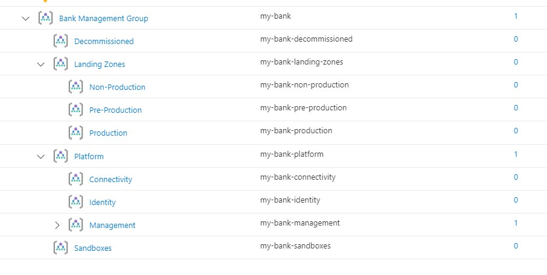

# Azure Landing Zones for Financial Services Industry in Malaysia

The purpose of the reference implementation is to guide [Bank Negara of Malaysia’s Risk Management in Technology (RMiT) Regulatory Compliance](https://www.bnm.gov.my/documents/20124/963937/Risk+Management+in+Technology+%28RMiT%29.pdf/810b088e-6f4f-aa35-b603-1208ace33619?t=1592866162078). This guide helps to ensure that the Microsoft Malaysian financial institutions customers on building Landing Zones in their Azure environment. The reference implementation is based on [Cloud Adoption Framework for Azure](https://docs.microsoft.com/azure/cloud-adoption-framework/ready/landing-zone/) and provides an opinionated implementation that enables to ensure that technology risk management framework (TRMF) 9.2 (e), (f), (g) and cyber resilience framework (CRF) 11.3 (d), (e), (g) remain relevant on an ongoing basis and meet the regulatory compliance by using [NIST SP 800-53 Rev. 4](https://docs.microsoft.com/azure/governance/policy/samples/nist-sp-800-53-r4) and [Risk Management in Technology (RMiT) policies.](https://docs.microsoft.com/en-us/azure/governance/policy/samples/rmit-malaysia)

## Table of Contents

1. Key Decisions
2. Security Controls
3. Management Groups
4. Identity
5. Network
6. Logging
7. Tagging
8. Archetypes
9. Automation

#  1. Key Decisions

# 2. Security Controls

# 3. Management Groups

[Management Groups](https://docs.microsoft.com/azure/governance/management-groups/overview) enable organizations to efficiently manage access, governance and compliance across all subscriptions. Azure management groups provide a level of scope above subscriptions. Subscriptions are organized into containers called "management groups" and apply Azure Policies and role-based access control to the management groups. All subscriptions within a management group automatically inherit the settings applied to the management group.

Management groups give you enterprise-grade management at a large scale no matter what type of subscriptions you might have. All subscriptions within a single management group must trust the same Azure Active Directory tenant.

Azure Landing Zones for Financial Services Industry in Malaysia recommends the following Management Group structure. This structure can be customized based on your organization's requirements. Specifically:

- Landing Zones will be split by 3 groups of environments.
    - Production
    - Pre-Production
    - Non-Production
- Sandbox management group is used for any new subscriptions that will be created. This will remove the subscription sprawl from the Root - Tenant Group and will pull all subscriptions into the security compliance.

### Management Group Structure

Customers with existing management group structure can consider merging the recommended structure to continue to use the existing structure. The new structure deployed side-by-side will enable the ability to:

- Configure all controls in the new management group without impacting existing subscriptions.
- Migrate existing subscriptions one-by-one (or small batches) to the new management group to reduce the impact of breaking changes.
- Learn from each migration, apply policy exemptions, and reconfigure Policy assignment scope from pubsec to another scope that's appropriate.

# 4. Identity

# 5. Network

# 6. Logging

# 7. Tagging

# 8. Archetypes

# 9. Automation